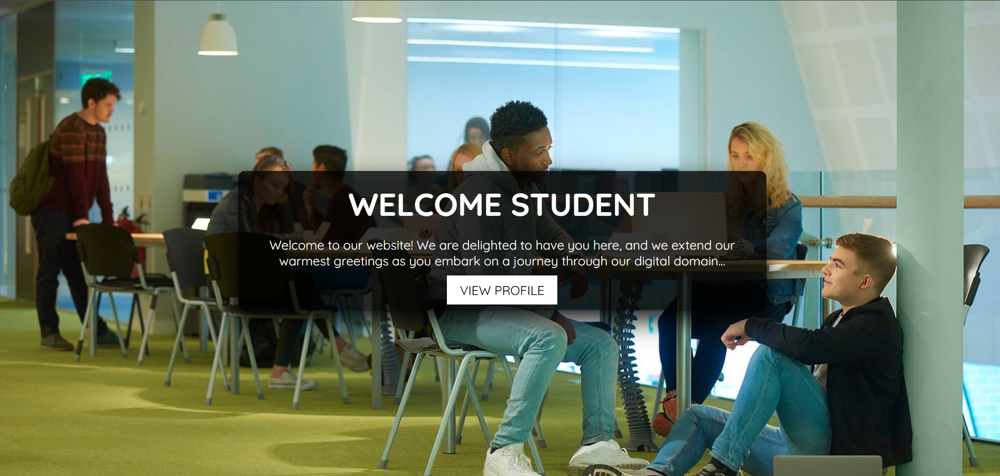

# 🎓 STUDENT MANAGEMENT SYSTEM
### *Full-Stack Enterprise Application with JWT Security*

**A robust management platform featuring secure authentication, image processing, and administrative controls.**

---

## 📖 Overview
This project is a sophisticated **Full-Stack Student Portal**. It utilizes **Spring Boot** for a high-performance backend and **React** for a dynamic, single-page frontend. The core focus of this application is **Security** and **User Management**, utilizing **JWT (JSON Web Tokens)** to protect API endpoints and manage user sessions.

---

## 📸 Preview

  

## 🏗️ System Architecture

### Backend (Spring Boot)
The server follows a **Layered Architecture** to ensure scalability:
* **Controllers:** REST endpoints for User, Admin, and Image management.
* **Services:** Business logic implementation (UserService, RoleService).
* **DAO/Repositories:** Data access layer utilizing **Spring Data JPA**.
* **Security:** **Custom JWT Filter** and **CORS configuration** for secure cross-origin communication.

### Frontend (React)
* **Protected Routes:** Navigation guarded by authentication status.
* **Admin Dashboard:** Specialized views for User Lists, Editing, and Adding users.
* **User Profile:** Interactive profile management including image uploads.

---

## ✨ Key Features
* **🔐 JWT Authentication:** Stateless security with token-based login and entry point handling.
* **👥 Role-Based Access (RBAC):** Distinct permissions and dashboards for `ADMIN` and `USER` roles.
* **🖼️ Image Management:** Upload and retrieve profile pictures with custom `ImageUtils` for processing.
* **⚡ CRUD Operations:** Complete lifecycle management for student records.
* **🌐 Cross-Origin Support:** Custom CORS configuration to bridge the React-Spring Boot gap.

---

## 💻 Tech Stack
| Component | Technology |
| :--- | :--- |
| **Backend Framework** | Spring Boot 3.x |
| **Frontend Library** | React.js |
| **Database** | MySQL / PostgreSQL |
| **Security** | Spring Security & JWT |
| **Data Access** | Spring Data JPA / Hibernate |

---

## 🚦 Getting Started

### Backend Setup
1. Configure your database credentials in `src/main/resources/application.properties`.
2. Run the `BackendApplication.java`.

### Frontend Setup
1. Navigate to the frontend directory.
2. Install dependencies: `npm install`.
3. Start the dev server: `npm start`.

---

## 📧 Contact
- *Developer:* [Faizal](https://github.com/faizal08)
- *Email:* [reachfaizal08@gmail.com](mailto:reachfaizal08@gmail.com)

## 📧 Contact
- **Developer:** [Faizal](https://github.com/faizal08)
- **Email:** [reachfaizal08@gmail.com](mailto:reachfaizal08@gmail.com)
